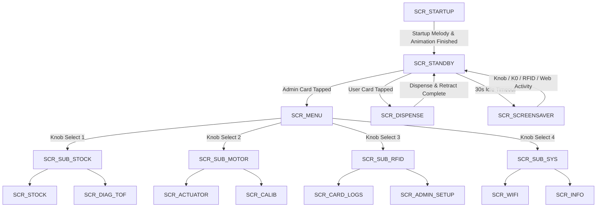

# 🏛️ AETHER System Architecture & Engineering Specification

> **Version**: 2.5.0  
> **Target Microcontroller**: ESP32-S3-DevKitC-1 (240MHz Xtensa Dual-Core, 8MB Flash, 320KB SRAM)  
> **Firmware Framework**: Arduino ESP32 Framework v3.x / PlatformIO  

---

## 1. Hardware Pinout & Peripheral Mapping

| Component | Pin / Interface | Function / Notes |
| :--- | :--- | :--- |
| **ST7789 TFT Display** | SPI (MOSI=11, SCLK=12, CS=10, DC=13, RST=14, BL=15) | 240x320 2.0" Color Display (SPI 40MHz) |
| **RC522 RFID Reader** | SPI / GPIO (SDA=9, RST=2, MISO=1) | 13.56MHz Mifare Card Reader |
| **DRV8833 Motor Driver** | GPIO (IN1=4, IN2=6, IN3=7, IN4=8) | Dual H-Bridge 5V Stepper Control |
| **TOF050C / VL6180X Sensor** | I2C (SDA=41, SCL=42, Addr=0x29) | Time-of-Flight Stock Distance Sensor |
| **Quadrature Rotary Encoder**| GPIO (ENC_A=17, ENC_B=18, ENC_SW=16) | Interrupt-driven quadrature input + push button |
| **K0 Kill Switch** | GPIO 0 (BOOT Button / Pull-up) | Instant Emergency Stop / Back Button |
| **Piezo Buzzer** | GPIO 5 | Non-blocking tone audio alerts |
| **WS2812 RGB LED** | GPIO 48 & 38 | Built-in RGB Telemetry LED (Breathing Rainbow in Standby) |

---

## 2. Firmware UI State Machine (`curScreen`)

---

## 3. Advanced Features & System Behavior

1. **Secret Stealth Mode Toggle (2x K0 + 2x Knob Press within 5s)**:
   - Pressing K0 twice and Knob button twice within 5 seconds turns off the display backlight (`digitalWrite(TFT_BLK, LOW)`), turns off the RGB LED, and clears power indicators while **keeping Wi-Fi, Web Server, MQTT, and Board background loops running 100% active**.
   - Repeating the combo code turns the machine back ON instantly with power-up audio chime!

2. **30-Second Idle 3D Octahedron Screensaver**:
   - If the machine is in `SCR_STANDBY` and idle for **> 30 seconds** without any interaction, it automatically enters Screensaver mode (`SCR_SCREENSAVER`), rendering a smooth 3D Rotating Wireframe Octahedron Diamond.
   - Any knob rotation, button press, RFID card scan, or Web command **instantly exits the screensaver** back to Standby. If the user is interacting with the machine or dispensing, screensaver is **strictly blocked**.

3. **Breathing Rainbow RGB LED**:
   - While idle in Standby mode, the built-in WS2812 RGB LED smoothly cycles through HSL spectrum colors for a modern aesthetic look.

4. **High-Contrast Standby QR Title**:
   - Features a dark backdrop header box (`tft.fillRect(0,0,SW,50)`) with gold "AETHER" title text and high-contrast subtext above the QR code.

5. **Bold Size 2 Text & Marquee Ticker Scroll**:
   - All menu items use **Size 2 Bold Text**. If a highlighted menu label is longer than 13 characters, it smoothly marquee scrolls right-to-left in-place without full-screen flicker.

6. **Persistent NVS Data Retention Across Firmware Updates**:
   - All Admin Cards, Wi-Fi configurations, stock depths, and theme settings are stored in dedicated flash NVS sectors (`"admin-store"`, `"motor-store"`, `"wifi-store"`). Updating firmware over USB or OTA will **never delete user data or Wi-Fi credentials**.

---

## 4. Unified Stepper Motor Driver Physics & Parameters

Motor movement is managed by the **Unified Motion Dispatcher** (`moveToTargetSmooth()` / `executeGlobalMotorMove()`). Both RFID Card Dispensing and Web/Knob controls execute through this identical, zero-jitter motion pipeline.

### Operating Tuning Parameters (5V DRV8833 Driver)

| Setting | Value | Engineering Function |
| :--- | :--- | :--- |
| `totalSteps` | `3200` steps | Total travel steps for full 80mm linear stroke |
| `startSpeed` | `2600 µs` / step | Solid breakaway delay to deliver peak magnetic flux saturation |
| `maxSpeed` | `1800 µs` / step | Optimal 5V coil current saturation cruise speed under physical load |
| `rampSteps` | `80` steps | Short linear S-curve ramp for instant high-torque push force |
| `doStep()` | 2-Phase Full-Step | Phase sequence: `(1,0,1,0) -> (0,1,1,0) -> (0,1,0,1) -> (1,0,0,1)` |
