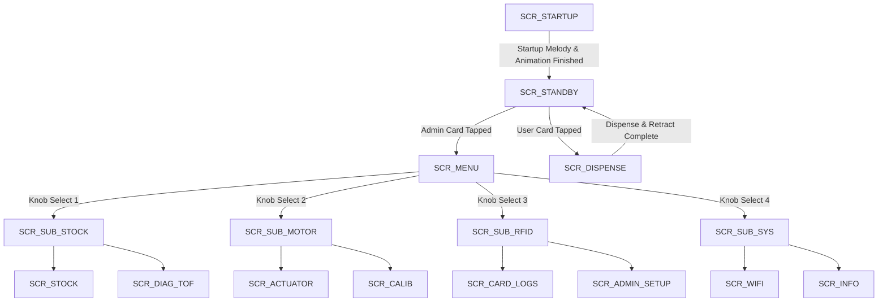

# 🏛️ AETHER System Architecture & Engineering Specification

> **Version**: 2.4.0  
> **Target Microcontroller**: ESP32-S3-DevKitC-1 (240MHz Xtensa Dual-Core, 8MB Flash, 320KB SRAM)  
> **Firmware Framework**: Arduino ESP32 Framework v3.x / PlatformIO  

---

## 1. Hardware Pinout & Peripheral Mapping

| Component | Pin / Interface | Function / Notes |
| :--- | :--- | :--- |
| **ST7789 TFT Display** | SPI (MOSI=11, SCLK=12, CS=10, DC=13, RST=14, BL=15) | 240x320 2.0" Color Display (SPI 40MHz) |
| **RC522 RFID Reader** | SPI / GPIO (SDA=9, RST=2, MISO=1) | 13.56MHz Mifare Card Reader |
| **DRV8833 Motor Driver** | GPIO (IN1=4, IN2=6, IN3=7, IN4=8) | Dual H-Bridge 5V Stepper Control |
| **TOF050C / VL6180X Sensor** | I2C (SDA=41, SCL=42, Addr=0x29) | Time-of-Flight Stock Distance Sensor |
| **Quadrature Rotary Encoder**| GPIO (ENC_A=17, ENC_B=18, ENC_SW=16) | Interrupt-driven quadrature input + push button |
| **K0 Kill Switch** | GPIO 0 (BOOT Button / Pull-up) | Instant Emergency Stop / Back Button |
| **Piezo Buzzer** | GPIO 5 | Non-blocking tone audio alerts |
| **WS2812 RGB LED** | GPIO 48 & 38 | Built-in RGB Telemetry LED |

---

## 2. Firmware UI State Machine (`curScreen`)

---

## 3. Zero-Flicker SPI Graphic Rendering Engine

To achieve **100% Zero-Flicker** performance across the 240x320 SPI LCD:

1. **In-Place Slot Updating**:
   - `updateSubMenuSelection()` updates ONLY the rectangular bounding boxes of newly highlighted menu items (`Size 2 Bold Text`).
   - `drawStockData()` updates numerical distance/percentage text in-place without `fillScreen()` calls.
   - `drawI2cDiagData()` refreshes live TOF sensor readings in-place.

2. **Static Frame Initialization & Zero-Wipe Overlay**:
   - `drawCareDispenseFrame()` renders the background frame, header bar, and footer **once** on screen entry.
   - `drawCareDispenseAnimation()` draws flower petals, golden core, and pulsing heart directly over canvas coordinates without calling full-screen or circular background wipes (`fillCircle` / `fillRect`).
   - Text banners overwrite in-place using text background colors (`setTextColor(fg, bg)`).

---

## 4. Unified Stepper Motor Driver Physics & Parameters

Motor movement is managed by the **Unified Motion Dispatcher** (`moveToTargetSmooth()` / `executeGlobalMotorMove()`). Both RFID Card Dispensing and Web/Knob controls execute through this identical, zero-jitter motion pipeline.

### Operating Tuning Parameters (5V DRV8833 Driver)

| Setting | Value | Engineering Function |
| :--- | :--- | :--- |
| `totalSteps` | `3200` steps | Total travel steps for full 80mm linear stroke |
| `startSpeed` | `2600 µs` / step | Solid breakaway delay to deliver peak magnetic flux saturation |
| `maxSpeed` | `1800 µs` / step | Optimal 5V coil current saturation cruise speed under physical load |
| `rampSteps` | `80` steps | Short linear S-curve ramp for instant high-torque push force |
| `doStep()` | 2-Phase Full-Step | Phase sequence: `(1,0,1,0) -> (0,1,1,0) -> (0,1,0,1) -> (1,0,0,1)` |

---

## 5. Persistent NVS Multi-Admin Card Security & Dispensing Guards

1. **NVS Multi-Admin Storage**:
   - Registered Admin Cards are saved in non-volatile flash under NVS namespace `"admin-store"`. Stored UIDs are sanitized (`cleanUid()`) of spaces and formatting.
   - Up to 5 Admin Cards can be registered.

2. **Admin Tap Session Lock**:
   - Tapping any registered Admin Card instantly toggles Main Menu access (`SCR_MENU`).
   - Displays an `ADMIN` header badge in green box.
   - Disables the 10-second menu idle auto-exit timer so administrators can configure settings without timeout.

3. **Dispensing Guard Rule**:
   - Dispensing is strictly restricted to `curScreen == SCR_STANDBY`.
   - Tapping any card while inside Admin Card Setup or Menu screens will **never** trigger motor dispensing.

4. **Instant Auto-Save in Admin Setup**:
   - Tapping any RFID card while in `Admin Card Setup` (`SCR_ADMIN_SETUP`) instantly registers it into NVS, displays a green `[+] SAVED: 44A1B2C3` banner, and plays a victory audio chime.

---

## 6. Software Feature Wishlist & Future Enhancements

Documented in `WISHLIST.md`:
- **Over-The-Air (OTA) Firmware Updates** via Web Dashboard.
- **Low-Stock Automatic Email/MQTT Alerts** when inventory falls below 20%.
- **Dispense Quota Management** per user card ID within 24 hours.
- **Anti-Jam Auto-Recovery Routine** with double pulse retries.
